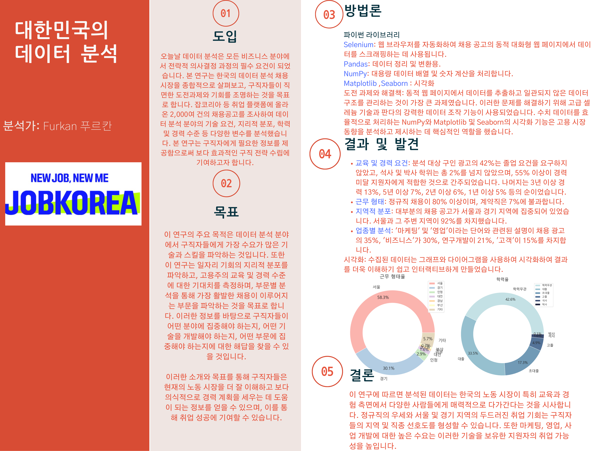
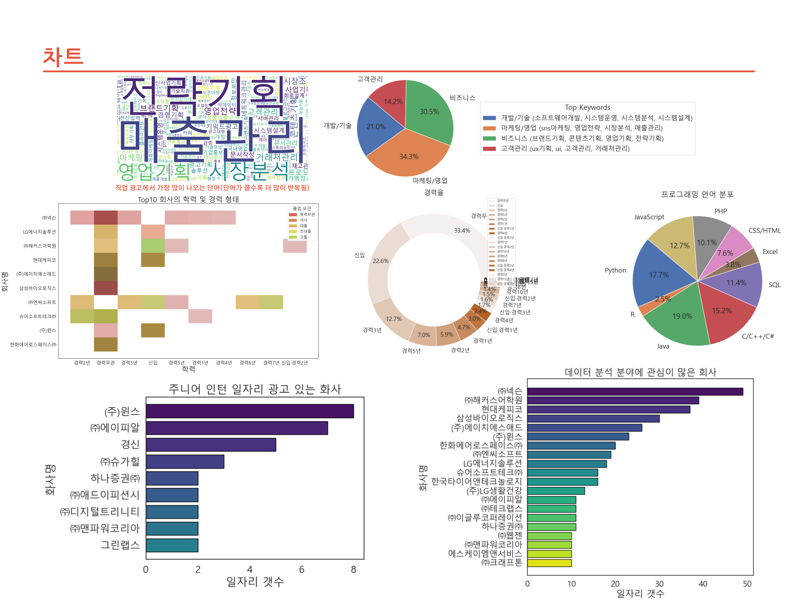

# 대한민국의 데이터 분석
 
데이터 분석은 회사가 중요한 결정을 내릴 때 자주 사용하는 분야가 되었습니다.
한국 구직자의 도전과 기회 대해 알아봅니다.
데이터 분석 분야의 기술 요건, 지리적 분포, 학력 및 경력 수준 등 다양한 변수를 분석했습니다.

이 연구의 주요 목적은 데이터 분석 분야에서 구직자들에게 가장 수요가 많은 기술과 스킬을 파악하는 것입니다.
가장 활발한 채용이 이루어지는 부문을 파악하는 것을 목표로 
합니다.  구직자들이 어떤 분야에 집중해야 하는지, 어떤 기술을 개발해야 하는지, 어떤 부문에 집
중해야 하는지에 대한 해답을 찾을 수 있을 것입니다. 
Data analytics has become a field that companies often use to make important decisions. Learn about the challenges and opportunities for job seekers in Korea. Analyzed a variety of variables, including skill requirements, geographic distribution, and education and experience levels in the data analytics field.

The main objective of this study is to identify the skills and skills that are most in demand by job seekers in the field of data analytics. Aim to identify the sectors where the most active hiring is taking place. It will provide answers to the questions of what areas job seekers should focus on, what skills they should develop, and what sectors they should focus on.
 
 

